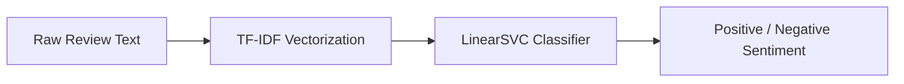

# IMDb Movie Review Sentiment Analysis Using TF-IDF and Classical Machine Learning

An interactive web application built with **Streamlit** to perform real-time binary sentiment classification on IMDb movie reviews using a classical machine learning pipeline (**TF-IDF + LinearSVC**).

---

## Project Overview

Sentiment analysis of movie reviews is a fundamental natural language processing (NLP) task. The goal of this project is to analyze raw review text and accurately classify whether the viewer's sentiment is **Positive** or **Negative**.

This project demonstrates an end-to-end machine learning deployment workflow—from data preprocessing and feature extraction using Term Frequency-Inverse Document Frequency (TF-IDF) to model training with Linear Support Vector Classification (LinearSVC) and web deployment via Streamlit.

---

## Dataset

The model is trained and evaluated on the benchmark **IMDb Large Movie Review Dataset**:

- **Total Reviews:** 50,000 highly polar movie reviews.
- **Training Set:** 25,000 labeled reviews.
- **Test Set:** 25,000 labeled reviews.
- **Classes:** Balanced 50/50 split between Positive and Negative reviews.

---

## Machine Learning Workflow



1. **Text Vectorization (`TF-IDF`):**
   - Lowercasing & English stop-words removal
   - Unigrams and Bigrams (`ngram_range=(1, 2)`)
   - Term frequency filtering (`min_df=2`, `max_df=0.95`)
   - Sublinear term frequency scaling (`sublinear_tf=True`)

2. **Classifier (`LinearSVC`):**
   - Linear Support Vector Machine (`C=1.0`, `random_state=42`)
   - Selected via 5-fold cross-validation during notebook development.

3. **Artifact Deployment:**
   - The complete scikit-learn `Pipeline` (TF-IDF vectorizer + LinearSVC classifier) is serialized as `IMDB_Sentiment_Model.pkl` for fast, lightweight inference.

---

## Model Evaluation

The final model performance evaluated on the 25,000 held-out test reviews:

| Metric | Score |
| :--- | :--- |
| **Accuracy** | **88.89%** |
| **Precision** | **89.20%** |
| **Recall** | **88.49%** |
| **F1-Score** | **88.84%** |

---

## Streamlit Application

The Streamlit web application allows users to:
1. Select an iconic movie from a dropdown menu (e.g., *The Shawshank Redemption*, *The Dark Knight*, *Inception*).
2. Enter a custom movie review.
3. Click **Analyze Sentiment** to get an immediate sentiment prediction (**POSITIVE** or **NEGATIVE**).

> 💡 **Important Note:** The selected movie title serves purely as UI visual context for the user experience. Only the raw review text is passed to the machine learning model.

---

## How to Run Locally

### 1. Prerequisites
Ensure Python 3.9+ is installed on your system.

### 2. Clone the Repository
```bash
git clone https://github.com/YOUR_USERNAME/IMDb-Movie-Review-Sentiment.git
cd IMDb-Movie-Review-Sentiment
```

### 3. Install Dependencies
```bash
pip install -r requirements.txt
```

### 4. Launch the Streamlit App
```bash
streamlit run app.py
```

The application will open automatically in your browser at `http://localhost:8501`.

---

## Deployment on Streamlit Community Cloud

To deploy this project online for free using **Streamlit Community Cloud**:

1. **Push Code to GitHub:**
   - Create a new repository on GitHub (e.g. `IMDb-Movie-Review-Sentiment`).
   - Commit and push `app.py`, `IMDB_Sentiment_Model.pkl`, `requirements.txt`, and `README.md`.

2. **Deploy via Streamlit Cloud:**
   - Go to [share.streamlit.io](https://share.streamlit.io/).
   - Sign in with your GitHub account.
   - Click **New App**.
   - Select your repository, branch (`main`), and main file path (`app.py`).
   - Click **Deploy!**

---

## Project Structure

```text
IMDb-Movie-Review-Sentiment/
│
├── app.py                            # Streamlit web application
├── IMDB_Sentiment_Model.pkl          # Serialized scikit-learn Pipeline (TF-IDF + LinearSVC)
├── IMDB_Movie_Review_Sentiment_Analysis.ipynb  # Final research & training notebook
├── requirements.txt                  # Python dependencies
└── README.md                         # Project documentation
```
